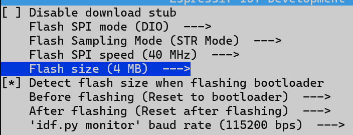
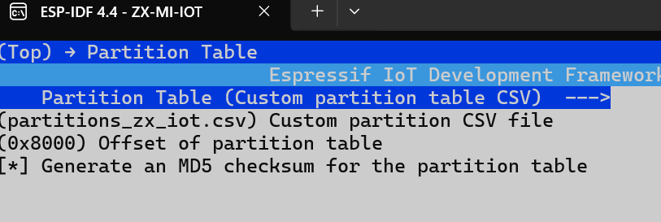

# zx-iot-mi
ZX-Wespi: ESP32-based Wifi-enabled Fileserver for ZX81 with very simple DIY interfacing circuit


## Version Info

0.2.0 Initial pre-release

0.2.1 Improvements:

      - Max WLAN password size incremented from 31 to 64 characters

      - MAC Addr of module shown in SYS menu

0.2.2 Improvements:

      - Free space info in file server


## Building this with ESP-IDF

The current version that works is ESP-IDF Version 4.4 with Windows or Linux

Download and install - then run 

```bash
idf.py set-target esp32
idf.py menuconfig
```

Set up the serial flasher command as per instructions here 

https://docs.espressif.com/projects/esp-idf/en/v4.4/esp32/get-started/index.html

Makes sure the cache is set to 4mb not 2mb. 



Set the partition table to be with partitions_zx_iot.csv



Use idf.py build - this should build everything and the locations of the binaries and values are the same as the prebuilt ones except the paths will be to the build directory

- Run the tool, go to "Developer Mode", "ESP32", choose "SPI download" tab
- Set up the following files and positions to flash:

  + build/partition_table/partition-table.bin     @  0x8000 
  + build/ota_data_initial.bin                    @  0xd000
  + build/bootloader/bootloader.bin               @  0x1000
  + build/zx_iot_video.bin		                    @ 0x10000

- For the rest of parameters, use:

  + SPI SPEED 40MHz
  + SPI MODE DIO
  + FLSH SIZE 32MBit  (=4MB)
  + COM: (need to find out, look up in your OS' device manager in case of doubt)
  + BAUD: 460800 (may pick a different baud rate)

 


## Downloading the firmware to the ESP32 Module - pre built 

Info for the flash files and initial image download for the ZX-Wespi project:

ZX-Wespi is usually able to do over-the-air (OTA) updates via the webserver user interface. 

However, for the following cases a regular download of the flash image is required:

- When initially setting up a brand new ESP32 for your Zeddy
- If something went really wrong during OTA
- If you want to reuse an ESP32 that was used in a different project

This short instruction is for using the ESP32 download tool (tested with V3.8.5)


- Connect ESP32 to computer via USB or COM as applicable

- Get the download tool, at time of writing available at  <https://www.espressif.com/en/support/download/other-tools>, choose flash_download_tool_v3.8.5 or higher
- Run the tool, go to "Developer Mode", "ESP32", choose "SPI download" tab
- Set up the following files and positions to flash:

  partition-table.bin     @  0x8000 
  ota_data_initial.bin    @  0xd000
  bootloader.bin          @  0x1000
  zx_iot.bin		  @ 0x10000

- For the rest of parameters, use:

  SPI SPEED 40MHz
  SPI MODE DIO
  FLSH SIZE 32MBit  (=4MB)
  COM: (need to find out, look up in your OS' device manager in case of doubt)
  BAUD: 460800 (may pick a different baud rate)


- Press start to flash. If the ESP32 does not connect automatically, try holding the BOOT knob and/or EN(reset) 


Instruction v2.0
